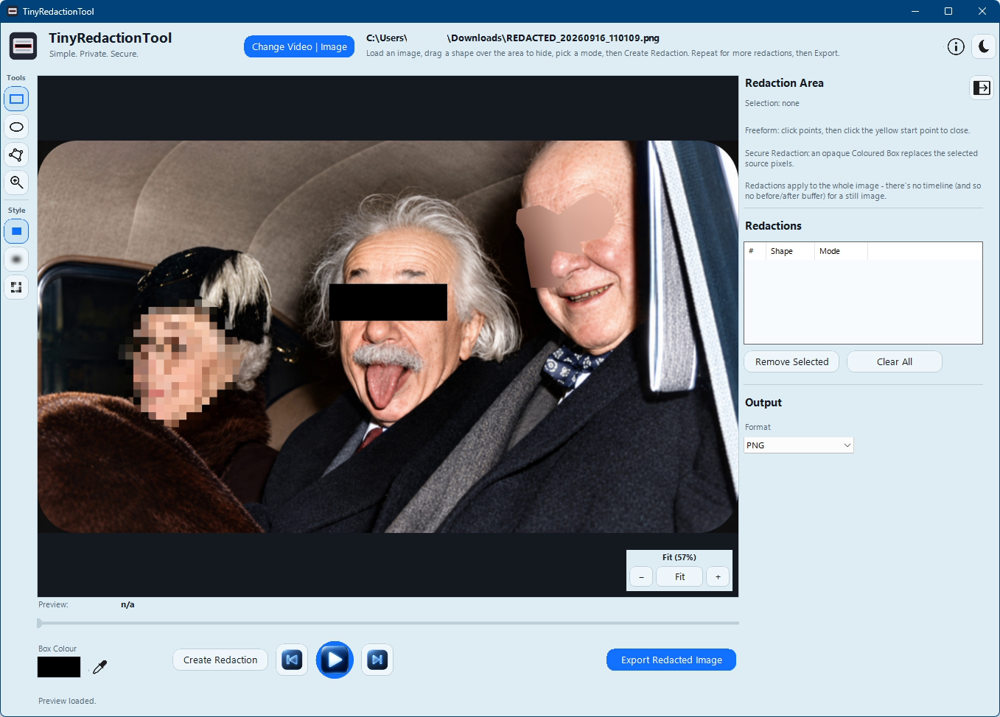

# TinyRedactionTool

TinyRedactionTool is a Windows desktop utility for **local redaction of still images and video**. It is designed for workflows that may involve sensitive information and therefore prefers fail-closed behaviour when media timing, export validation, or trusted-tool integrity cannot be established safely.

The tool was created and audited using AI assistance.  
All files contained here are **as is**. Issues and pull requests are not monitored. Individual troubleshooting and support cannot be provided.  
You’re welcome to fork and adapt this project for your own use. If you do, please retain attribution or otherwise acknowledge the original project.



## Full feature list

### Selection and redaction

- Rectangle selection.
- Oval selection.
- Freeform/polygon selection.
- Move an uncommitted Rectangle, Oval or closed Freeform selection before committing it.
- Hold **Shift** while drawing a Rectangle/Oval to constrain it to a square/circle.
- Hold **Shift** while adding Freeform points to snap the next segment to horizontal, vertical or 45-degree angles.
- Opaque **Black/Coloured Box** redaction for permanent pixel replacement.
- User-selectable box colour.
- Eyedropper tool to sample a colour directly from the loaded frame/image.
- **Blur** visual obscuration with adjustable strength.
- **Pixelate** visual obscuration with adjustable strength.
- Session-only warning suppression for Blur/Pixelate security warnings.
- Video redactions use explicit **Begin Redaction** and **End Redaction** frame markers.
- Automatic **2-frame temporal safety buffer** before and after each marked video range.
- Automatic **1-pixel outward spatial safety margin** for secure opaque exports where media bounds allow it.
- Redaction list showing shape, mode and marked range.
- Remove selected redactions or clear all redactions.
- Timeline markers show committed video redaction ranges.
- Draft and committed redaction geometry is stored in canonical displayed-media coordinates rather than screen/control coordinates.

### Zoom, pan and preview navigation

- Dedicated Zoom tool in the left toolbar.
- Pointer-centred **left-click zoom in**.
- Pointer-centred **right-click zoom out**.
- Pointer-centred **mouse-wheel zoom**.
- Visible `−  Fit  +` zoom controls in the preview.
- Live zoom indicator such as `Fit (43%)` or `200%`.
- **100% = one displayed-media pixel per screen pixel**.
- Manual zoom up to **800%**.
- Drag with the Zoom tool to pan.
- Hold **Space + drag** while Rectangle/Oval/Freeform is selected for temporary pan without changing drawing tools.
- Fit mode preserves aspect ratio and permits letterboxing rather than stretching media.
- Manual zoom/pan survives frame stepping, seeking, playback, pause, panel collapse/restore and window resize/maximise/restore.
- Opening new media resets the viewport to Fit.
- Redactions remain attached to the same media pixels at every zoom level and pan position.
- Preview selection outlines remain approximately constant in screen-pixel thickness instead of scaling into oversized borders.

### Video timing and playback

- CFR video support.
- Native **VFR (variable-frame-rate)** support without converting the source to a temporary CFR file.
- FFprobe-backed per-frame timing map using real presentation timestamps.
- Exact logical-frame Previous/Next navigation.
- Left/Right arrow keyboard shortcuts for previous/next frame.
- Click-and-drag timeline seeking mapped to presentation time.
- Play/Pause preview playback.
- Playback cadence follows actual per-frame presentation durations for VFR sources.
- Current preview time and logical frame number display.
- Redaction activation uses logical frame indexes rather than `frame / fps` arithmetic.
- Exact-PTS preview extraction fails closed instead of silently substituting a neighbouring frame.
- 90°, 180° and 270° rotation/orientation handling through the same autorotated displayed-media coordinate convention used for export.

### Image and video export

- Video export: **MP4, MOV, M4V, AVI, MKV, WebM**.
- Image export: **PNG, JPG, GIF, WebP**.
- H.264 output for MP4/MOV/M4V/AVI/MKV.
- VP9 output for WebM.
- High quality, Normal quality and Smaller file size presets.
- Audio retention is **off by default**.
- Optional primary-audio retention only (`0:a:0`).
- AAC audio for non-WebM video output and Opus for WebM.
- Separate warning before retaining audio because TinyRedactionTool does not inspect or redact spoken content.
- Source metadata, stream metadata and chapters stripped from exports.
- Subtitle, data, attachment and unintended extra audio streams excluded.
- Neutral default output name: `REDACTED_yyyyMMdd_HHmmss.ext`.
- Source media is read-only from TinyRedactionTool's perspective; export is always written separately.

### Export validation and fail-closed behaviour

- Export is first written to a same-directory `.partial.<GUID>` file.
- The partial output is structurally inspected with the bundled FFprobe before finalisation.
- Stream counts/types, chapters, metadata keys, dimensions and expected audio state are checked.
- Video exports rebuild and compare the complete output frame timeline against the source timing map.
- Exact decoded frame-count equality is required for video.
- Per-frame presentation timestamps must remain within a tight muxer-quantisation tolerance.
- Generated video is decode-checked before promotion to the requested destination.
- Existing destination files are not replaced until validation succeeds.
- Failed encoding/validation/finalisation removes the partial output where possible and leaves the existing destination untouched.

### Local-processing, privacy and media-tool trust

- Local media processing; no TinyRedactionTool media-upload service.
- No application telemetry.
- No background update checker.
- No FFmpeg/FFprobe `PATH` fallback in the packaged application.
- Single-file EXE embeds a private custom FFmpeg and FFprobe build.
- Embedded media tools are extracted to a unique random runtime directory.
- Exact FFmpeg/FFprobe SHA-256 values are injected during the release build and verified at startup.
- Verified runtime tool files are held open with read-only sharing locks for the GUI session to prevent ordinary post-verification replacement/modification.
- Custom FFmpeg build has networking disabled while retaining required local file/pipe protocols.
- Unredacted preview frames are piped through memory instead of intentionally being written as temporary image files.
- Non-rectangular temporary mask PNGs contain generated geometry/colour coverage, not copied source imagery.
- Network/mapped-drive source warning before opening unredacted media.
- Separate network/mapped-drive destination warning before saving exported media.
- Network warning suppression is session-only and source/destination suppression states are separate.
- Best-effort Windows Recent Items suppression using `OFN_DONTADDTORECENT`.
- Captured FFmpeg/FFprobe error text replaces the current source path with `[source media]` where practical and truncates oversized diagnostics.

### User interface and workflow

- Compact Windows PowerShell/WinForms desktop UI.
- Day and Dark modes with themed toolbar icons.
- Compact left toolbar for Rectangle, Oval, Freeform, Zoom, Coloured Box, Blur and Pixelate.
- Collapsible **Redaction Area** side panel; preview expands when the panel is collapsed.
- Selection X/Y/Width/Height readout.
- Security-mode guidance distinguishing opaque redaction from visual obscuration.
- Status/progress feedback during media analysis and export.
- Compact warning dialogs for Blur/Pixelate, audio and network/cloud paths.
- About dialog identifies **TinyRedactionTool v2.0.0**, GPL-2.0-or-later licensing and local-processing/no-telemetry posture.
- GitHub repository URL in About is non-clickable and has a dedicated copy-to-clipboard icon.
- Custom application/taskbar icon in the packaged v2.0.0 EXE.

### Standalone build

- Runs as a single **64-bit Windows EXE** after packaging.
- No separate FFmpeg installation or PATH configuration required for the standalone build.
- Release builder targets Windows PowerShell 5.1 and uses pinned PS2EXE 1.0.18.
- Builder performs functional FFmpeg/FFprobe smoke tests before packaging, including exact-frame selection and VFR timestamp round trips.
- v2.0.0 builder refuses to package a source file or approved media-tool binary whose SHA-256 does not match the frozen release values.

> **Important:** Black/Coloured Box is the security-oriented opaque redaction method. **Blur and Pixelate are visual obscuration only** and must not be treated as irreversible redaction.

## Current release

**Version:** v2.0.0  
**License:** GPL-2.0-or-later  
**Repository:** https://github.com/mccabedd/tinyredactiontool/

### Verified v2.0.0 release build

The final Windows standalone build was produced and independently hash-checked on **2026-09-16** after the full v2.0.0 regression pass and packaged-runtime smoke tests.

| Artifact | SHA-256 |
|---|---|
| `TinyRedactionTool.exe` | `F2C76CA945209101BADA2D995056BE3B8B3CC3763FAFED08E3A29E394F397A4F` |
| frozen v2.0.0 RC3 source | `11698B006A1FF8759D7FF222246475FE9B0A091C5A4F61023AC4649ACBF2B4FB` |
| approved embedded `ffmpeg.exe` | `28612C0A94D50A29AABD0555C91E086D1CCDF13260757B83B4BBD53A0C2CDCE0` |
| approved embedded `ffprobe.exe` | `BB8CBA76F9D4F05DD608F319477A0604D8A8C289FB6A885B03919F07C4DC9855` |
| secure builder package r2 | `D90F75E81A1A0BF07529D08CCF665B4BCF451EF05C5390C59D0D008DF8DB7813` |

RC3 differs from the fully regression-tested RC2 only by assigning the packaged EXE's embedded custom icon to the main WinForms window/taskbar. No media, redaction, zoom/pan, timing, export or security logic changed.

The v2.0.0 regression matrix covered still images, CFR and VFR video, 90°/180°/270° rotation, Rectangle/Oval/Freeform, Black/Blur/Pixelate, exact Begin/End frame activation, playback/seeking/frame stepping, zoom/pan, audio handling, metadata/chapter stripping, WebM, panel resize/collapse and mixed-state torture testing.

## Supported media

The Open dialog recognises the following extensions. Actual decode success still depends on the capabilities of the pinned FFmpeg build and the validity of the media.

**Video:** `.mp4`, `.mov`, `.m4v`, `.avi`, `.mkv`, `.webm`, `.wmv`, `.asf`, `.mpg`, `.mpeg`, `.mpe`, `.vob`, `.ts`, `.mts`, `.m2ts`, `.m2t`, `.flv`, `.3gp`, `.3g2`, `.f4v`, `.ogv`, `.rm`, `.rmvb`, `.mxf`, `.wtv`, `.dv`, `.mjpeg`, `.mjpg`, `.mlv`, `.r3d`

**Images:** `.jpg`, `.jpeg`, `.jpe`, `.png`, `.apng`, `.gif`, `.webp`, `.bmp`, `.tif`, `.tiff`, `.tga`, `.dds`, `.exr`, `.hdr`, `.dpx`, `.jp2`, `.j2k`, `.j2c`, `.jpc`, `.jls`, `.psd`, `.pcx`, `.qoi`, `.avif`, `.heic`, `.heif`

### Export formats

**Video:** MP4, MOV, M4V, AVI, MKV, WebM  
**Images:** PNG, JPG, GIF, WebP

Video exports use explicit codecs. MP4/MOV/M4V/AVI/MKV use H.264; WebM uses VP9. Audio, when deliberately retained, is encoded as AAC for non-WebM outputs and Opus for WebM.

## Redaction modes

### Black/Coloured Box

This is the mode intended for information that must not remain visible in the exported media.

- Rectangle redactions use an opaque filled FFmpeg `drawbox`.
- Oval and Freeform redactions use binary opaque masks for the security boundary; anti-aliased semi-transparent mask edges are deliberately disabled.
- Secure opaque exports receive a small **1-pixel outward spatial safety margin** where media bounds allow it.
- Video redactions receive a **2-frame temporal safety buffer on each side** of the user-selected range.
- Export activation is based on exact logical frame indexes, not `frame / fps` arithmetic.

The application replaces pixels in the exported media. It does not delete or modify the original source file.

### Blur and Pixelate

Blur and Pixelate are provided for visual obscuration, not irreversible redaction. TinyRedactionTool warns about this when either mode is selected and recommends Black/Coloured Box for information that must not be recoverable.

The warning can be suppressed for the current application session only.

## Zoom and pan

Zoom/pan is a preview-only viewport feature. Redaction geometry is stored in canonical displayed-media coordinates and export does not depend on the current zoom factor or pan offset.

- `Fit` keeps the full displayed media visible without distortion.
- 100% means one displayed-media pixel equals one screen pixel.
- Manual zoom is capped at 800%.
- Left/right click and mouse wheel zoom around the pointer while the Zoom tool is active.
- Dragging with the Zoom tool pans the media.
- Holding Space while a Rectangle/Oval/Freeform tool is selected temporarily enables drag-to-pan without changing the selected drawing tool.
- Zoom/pan persists across frame stepping, seeking and playback, and new media resets to Fit.

## Native VFR support

TinyRedactionTool supports both CFR and variable-frame-rate video without converting the source to a temporary CFR file.

For every video, the trusted embedded FFprobe enumerates the presentation timing of every decoded frame. TinyRedactionTool builds an in-memory timing map containing frame identity, presentation timestamps/times, frame durations and key-frame information. The map must be internally usable and is independently reconciled against a complete FFmpeg decode count before the source is accepted.

The UI continues to use simple logical frame numbers, but timing-sensitive operations use the validated frame map:

- Previous/Next Frame moves by exact logical frame index.
- Seek-bar clicks map presentation time to the corresponding real source frame.
- Playback cadence uses actual frame presentation durations.
- Preview extraction uses FFmpeg `select` against the mapped source PTS, with `-copyts`; a missing exact target frame fails instead of silently returning a neighbour.
- Redaction ranges use exact frame indexes.
- FFmpeg filter activation uses `between(n,start,end)` rather than timestamp/FPS approximation.
- Video export uses timestamp-preserving frame-sync settings rather than silently forcing CFR.
- Post-export validation re-enumerates the decoded output timeline and checks it against the validated source timeline before finalisation.

If a safe, unique frame mapping cannot be established, the file is rejected.

## Rotation

Preview, media geometry and export use FFmpeg autorotation consistently. Rotation metadata/orientation cases at 90°, 180° and 270° were included in the v2.0.0 regression testing so that preview coordinates, selection placement and exported placement remain aligned.

## Audio

Audio retention is **off by default**.

If **Keep audio** is enabled, TinyRedactionTool displays a warning that audio is not inspected or redacted and will remain in the exported file. The warning suppression option lasts only for the current session.

When audio is enabled:

- only the primary source audio stream (`0:a:0`) is retained;
- additional commentary/secondary audio tracks are not carried through;
- source audio metadata is stripped;
- post-export validation requires exactly one audio stream when the source contains audio.

If sensitive information may be spoken, do not enable audio retention unless it has been reviewed separately.

## Metadata and extra streams

Exports explicitly remove:

- global metadata;
- stream metadata;
- chapters;
- subtitle streams;
- data streams;
- attachment streams;
- unintended extra audio streams.

Post-export inspection uses structured FFprobe JSON rather than parsing FFmpeg's human-readable banner output. A narrow allow-list permits only expected muxer/encoder housekeeping metadata keys.

The v2.0.0 regression pass includes metadata/chapter stripping checks. The historical v1.3.8 standalone security test also used deliberately fake global, stream and chapter metadata and confirmed that the fake values and chapter/data stream did not survive export.

## Local-processing and privacy model

TinyRedactionTool contains:

- no telemetry;
- no media-upload service;
- no background update checker;
- no PATH fallback for FFmpeg/FFprobe.

Media processing is performed locally by the embedded custom FFmpeg/FFprobe build.

The **About** dialog displays the GitHub repository URL as non-clickable text with a copy button. TinyRedactionTool does not launch the repository or initiate a browser/network connection from that URL. Copying it to the clipboard and opening it elsewhere is an explicit user action outside TinyRedactionTool.

### Network and cloud paths

UNC and mapped network paths are allowed, but TinyRedactionTool warns before:

- opening unredacted media from a detected network path; and
- saving an export to a detected network path.

Source and destination warning suppression are separate and session-only.

Network/cloud detection is intentionally described as best-effort. A local-looking folder may be synchronised by OneDrive, Dropbox, backup software or another service outside TinyRedactionTool's control.

## Memory-only preview

Decoded preview frames are sent from FFmpeg through stdout and loaded directly into process memory. TinyRedactionTool does not intentionally write unredacted decoded preview PNGs to disk.

Non-rectangular redactions may use temporary PNG mask files containing only geometry/colour information. They do not contain source/patient imagery.

## Trusted embedded FFmpeg and FFprobe

The release EXE contains a private FFmpeg and FFprobe build. TinyRedactionTool never searches `PATH` for replacements.

At runtime the media tools are:

1. expanded into a unique `%TEMP%\TinyRedactionTool\run-<GUID>\` directory;
2. verified against SHA-256 hashes injected during the build;
3. kept open under read-only sharing locks for the application session, preventing ordinary post-verification write/delete replacement;
4. used for all media inspection, preview and export work; and
5. removed on normal application exit.

If either binary is missing, unpinned, fails its hash check, or cannot be locked against modification, the packaged application fails closed rather than executing it.

The custom FFmpeg configuration disables network protocols at build time while retaining local file and pipe functionality required by TinyRedactionTool.

## Export transaction and validation

TinyRedactionTool never writes directly to the chosen final destination while the export is still unvalidated.

The workflow is:

1. create a same-directory `*.partial.<GUID>.<ext>` file;
2. encode the redacted output;
3. inspect streams, chapters, metadata, dimensions and duration;
4. for video, rebuild the output frame timeline and reconcile frame count and presentation times with the source timeline;
5. decode-check the generated media;
6. only after validation succeeds, atomically move/replace the requested destination where Windows/filesystem semantics permit it.

If encoding, validation or finalisation fails, the partial file is removed and any existing destination is left untouched.

## Filenames and Recent Items

The default output name is neutral:

```text
REDACTED_yyyyMMdd_HHmmss.ext
```

The source filename is not inherited into the suggested export name.

Native Windows Open/Save dialogs are invoked with `OFN_DONTADDTORECENT` as a best-effort Recent Items/MRU suppression measure. This does **not** guarantee that Windows, EDR, antivirus, shell history or other software leaves no forensic traces.

## Source-file behaviour

TinyRedactionTool reads the source and writes a separate export. It does not modify the original media.

Source immutability was runtime-tested by comparing SHA-256 before and after repeated processing.

## Error/path hygiene

Media-tool errors are sanitised where practical before being shown to the user. The current source path is replaced with `[source media]` in captured FFmpeg/FFprobe error text, and oversized error output is truncated.

This reduces accidental disclosure in dialogs/log capture but is not a promise that every operating-system or third-party diagnostic facility hides paths.

## Building from source

The secure builder targets **Windows PowerShell 5.1** and uses a cached MSYS2/MinGW environment under `_CustomFFmpegBuild`.

Major pinned inputs in the v2.0.0 release builder:

- FFmpeg source commit: `fd7c73d01e976d2e332e85862ab63ab608710834`
- MSYS2 base release asset ID: `560868716`
- MSYS2 archive size: `42915960` bytes
- MSYS2 archive SHA-256: `F6BBDE384F3331FB293C5051D5B9DBEC01C772BCCDCEEE83B78213801264D0BD`
- PS2EXE: `1.0.18`

Build with:

```powershell
.\BUILD-TinyRedactionTool-CUSTOM.cmd
```

Do not run the builder as Administrator unless there is a separate, unavoidable system reason to do so.

The builder validates the custom media tools on normal Windows before packaging, including functional tests for:

- required FFmpeg encoders/muxers/filters/protocols;
- networking being disabled;
- `null` + `wrapped_avframe`;
- `image2pipe` + PNG;
- exact logical-frame and exact-PTS preview selection;
- FFprobe per-frame timing enumeration;
- frame-index filter activation; and
- VFR timestamp-preserving round trips through MP4/H.264 and WebM/VP9.

Keep `_CustomFFmpegBuild` unless you intentionally want to discard the cached toolchain/source build.

### Reproducibility limitation

The builder pins the major inputs above, but MSYS2 packages are still obtained from signed rolling MSYS2 repositories. The complete compiler/library environment is therefore not immutable, and **bit-for-bit reproducibility is not claimed**.

## Known limitations and non-guarantees

TinyRedactionTool is designed to reduce accidental disclosure, not to control the entire Windows operating system. In particular:

- Windows pagefile may contain process memory outside application control.
- Crash dumps may contain process memory outside application control.
- EDR, Sysmon, antivirus and process-monitoring software may observe paths, process arguments or file activity.
- Screen-capture, clipboard, backup, snapshot and forensic tools are outside the application's control.
- A locally mounted folder may be cloud-synchronised by other software.
- Recent Items suppression is best-effort, not absolute.
- Abnormal termination can leave the extracted FFmpeg/FFprobe executables in their random TEMP directory; those binaries contain no patient/source media.
- The runtime file-sharing lock protects the verified media tools against ordinary post-verification file replacement/write operations; it is not a defence against a compromised operating system or privileged/kernel-level attacker.
- Broad input decoding/demuxing remains enabled for compatibility, so malformed-media parser risk is not eliminated.
- Audio content is not redacted when audio retention is enabled.
- Blur and Pixelate are not irreversible redaction.
- Universal cloud-sync detection is not possible.
- Long-path behaviour beyond ordinary Windows path limits is not claimed for the standalone build.
- OS-level forensic artefacts cannot be absolutely eliminated by an ordinary desktop application.

For the hardened packaging threat model and historical v1.3.8 standalone security-test record, see [`SECURITY-AUDIT.md`](SECURITY-AUDIT.md). For v2.0.0 release-specific changes and regression status, see `RELEASE-NOTES-v2.0.0.txt`.
