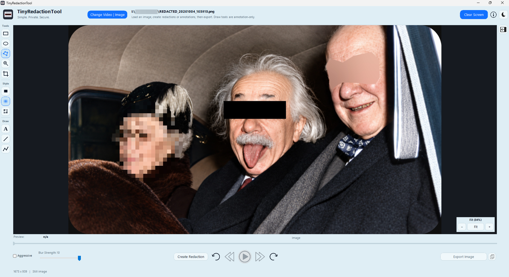

# TinyRedactionTool

TinyRedactionTool is a lightweight Windows desktop application for **locally redacting, annotating, cropping and capturing still images and video**.

It is designed for workflows involving sensitive material where sending media to an online editor, cloud service or browser-based redaction tool is undesirable.

TinyRedactionTool performs its media processing locally using bundled custom FFmpeg/FFprobe binaries. It contains **no telemetry, no media-upload service and no background update checker**.

> **Important:** For sensitive information, use **Black/Coloured Box** redaction.  
> **Blur** and **Pixelate** are visual-obscuration tools and must not be treated as irreversible redaction.

<p align="center">
  
</p>

## Download

The latest Windows release is available from:

**https://github.com/mccabedd/tinyredactiontool/releases/latest**

Release assets include:

- `TinyRedactionTool.exe` — standalone Windows x64 application.
- `TinyRedactionTool-v2.5.1-WINDOWS.zip` — packaged Windows release.
- `TinyRedactionTool-v2.5.1-SOURCE-BUILD.zip` — self-contained offline source/build package.
- `SHA256SUMS-v2.5.1.txt` — release checksums.

The current `TinyRedactionTool.exe` SHA-256 is:

```text
C50E88EFCA816C42175A0783A78AE9290A5217FFEEE8755738CBB2546ECA34DC
```

The application is currently unsigned, so Windows may display a SmartScreen warning.

## Quick start

1. Download `TinyRedactionTool.exe`.
2. Run it.
3. Open an image or video, or capture a region of the screen.
4. Select a redaction or annotation tool.
5. Draw and adjust the required area.
6. For video, mark the required Begin/End range where applicable.
7. Export the result.

No separate FFmpeg installation is required.

## Core features

### Redaction tools

TinyRedactionTool supports three selection shapes:

- **Rectangle**
- **Oval**
- **Freeform / polygon**

These can be used with:

- **Black / Coloured Box** — opaque pixel replacement.
- **Blur** — visual obscuration.
- **Pixelate** — visual obscuration.

Rectangle and Oval can be constrained while drawing or resizing by holding **Shift**.

Freeform supports constrained segment placement using **Shift** to snap new segments to horizontal, vertical or 45-degree directions.

Draft geometry can be moved and edited before it is committed:

- Rectangle: 8 resize handles.
- Oval: 4 cardinal resize handles.
- Freeform: draggable vertex handles plus whole-shape movement.

Committed Rectangle, Oval and Freeform redactions can be reopened for editing by double-clicking them.

### Opaque redaction

Black/Coloured Box is the security-oriented redaction method.

For exported media:

- Rectangle redactions use opaque replacement.
- Oval and Freeform redactions use opaque masks.
- Secure opaque exports receive a small outward spatial safety margin where media bounds permit it.
- Video redactions receive a temporal safety buffer around the selected logical-frame range.

The output contains replacement pixels rather than the obscured original pixels.

### Blur and Pixelate

Blur and Pixelate are provided for visual obscuration only.

Two processing modes are available:

- **Default** — conventional Blur or Pixelate.
- **Aggressive** — first reduces the protected region to a deliberately low-detail structural representation before applying the final visual effect.

Aggressive mode is intended to reduce recoverable visual structure, but it is **not a substitute for opaque redaction**.

TinyRedactionTool displays a warning when Blur or Pixelate is selected.

## Drawing and annotation tools

Annotations are separate from redactions and do not hide underlying content.

Available annotation tools include:

- **Text**
- **Line**
- **Polyline**
- **Rectangle Drawing**
- **Oval Drawing**
- **Freeform Drawing**

Rectangle, Oval and Freeform Drawing are **outline-only**. They do not create a Black Box, Blur or Pixelate interior.

Drawing appearance can be adjusted using the floating editor:

- border colour;
- line thickness;
- line style;
- applicable corner/join options.

Drawing annotations are shown live while they are being created.

Double-click an annotation to reopen its editor.

For video, annotations can use exact **Begin Annotation** and **End Annotation** logical-frame ranges. Annotation timing is separate from redaction timing and does not use the redaction safety buffer.

## Screenshot and screen recording

TinyRedactionTool includes built-in region capture.

### Screenshot

Press:

```text
Ctrl + Print Screen
```

Select the required screen region.

A screenshot captured by the current TinyRedactionTool session can immediately be:

- copied to the Windows clipboard; or
- exported as an image;

without first adding a redaction, annotation or crop.

Plain screenshot exports use a filename such as:

```text
SCREENSHOT_yyyyMMdd_HHmmss.ext
```

### Video capture

Press:

```text
Ctrl + Shift + Print Screen
```

Select the region to record.

During recording:

- a blinking red border identifies the capture area;
- a yellow **Stop Recording** control is shown.

Capture shortcuts remain available while TinyRedactionTool is resident in the system tray.

## Image crop

Still images can be cropped before export.

The Crop Image tool provides:

- an adjustable rectangular crop region;
- eight resize handles;
- an explicit **Confirm Crop** action.

Video cropping is not supported.

## Zoom and pan

The preview has a dedicated Zoom tool and additional navigation shortcuts.

Features include:

- pointer-centred zoom;
- mouse-wheel zoom while the pointer is over the preview;
- visible `−`, `Fit` and `+` controls;
- zoom up to 800%;
- 100% = one displayed-media pixel per screen pixel;
- Zoom-tool drag to pan;
- middle-button drag to pan without changing the selected tool;
- right-button drag to pan while preserving simple right-click actions;
- **Space + drag** temporary pan while using drawing tools.

Zoom and pan affect only the viewport. Redaction and annotation geometry remains attached to canonical media coordinates.

Opening new media resets the viewport to Fit.

## Rotation

Images and videos can be rotated in 90-degree steps before editing begins.

Available actions:

- 90° clockwise;
- 90° anticlockwise;
- repeated use for 180° or 270°.

Source orientation and user-selected rotation are handled separately.

The selected rotation is baked into exported pixels and dimensions rather than relying on output rotation metadata.

Rotation controls lock after editing geometry exists so existing coordinates are not silently transformed.

## Video timing and frame navigation

TinyRedactionTool supports both constant-frame-rate and variable-frame-rate video.

Video timing is based on FFprobe-derived presentation timestamps rather than simple frame-rate arithmetic.

Features include:

- exact logical-frame Previous / Next;
- Left / Right arrow frame navigation;
- presentation-time-aware timeline seeking;
- Play / Pause preview;
- playback cadence based on actual frame durations;
- logical-frame Begin/End ranges;
- exact-PTS preview extraction;
- timestamp-preserving export;
- post-export frame-count and timestamp validation.

If a safe and unique frame mapping cannot be established, the file is rejected.

## Export formats

### Video

Supported output containers:

- MP4
- MOV
- M4V
- AVI
- MKV
- WebM

Codecs:

- H.264 for MP4/MOV/M4V/AVI/MKV
- VP9 for WebM

Quality presets:

- High quality
- Normal quality
- Smaller file size

### Images

Supported output formats:

- PNG
- JPG
- GIF
- WebP

### Audio

Audio retention is **off by default**.

If **Keep Audio** is enabled:

- only the primary source audio stream is retained;
- non-WebM output uses AAC;
- WebM output uses Opus;
- extra audio streams are excluded.

TinyRedactionTool does **not** inspect or redact spoken content. A warning is shown before audio is retained.

## Export validation

Exports are transactional and fail closed.

TinyRedactionTool:

1. writes to a same-directory temporary partial file;
2. encodes the requested output;
3. inspects the result with the bundled FFprobe;
4. validates expected streams, metadata state and dimensions;
5. validates video frame count and presentation timing;
6. decode-checks generated media;
7. only then promotes the result to the requested destination.

If encoding or validation fails, the partial output is removed where possible and an existing destination is left untouched.

## Metadata and unwanted streams

Exports explicitly remove or exclude:

- global metadata;
- stream metadata;
- chapters;
- subtitle streams;
- data streams;
- attachment streams;
- unintended extra audio streams.

Only expected muxer/encoder housekeeping metadata is allowed through validation.

## Local-processing and privacy model

TinyRedactionTool contains:

- no telemetry;
- no media-upload service;
- no background update checker;
- no FFmpeg/FFprobe `PATH` fallback;
- no automatic browser launch from the About dialog.

The repository address shown in About is non-clickable. Copying it to the clipboard and opening it elsewhere is an explicit user action.

### Embedded media tools

The standalone EXE embeds private FFmpeg and FFprobe resources.

At runtime TinyRedactionTool:

1. creates a unique application-owned runtime directory;
2. expands the media tools;
3. verifies their SHA-256 hashes;
4. locks the verified files against ordinary modification/replacement for the session;
5. uses those exact files for inspection, preview and export;
6. removes recognised owned runtime files on normal exit.

If the media tools are missing, modified, unpinned or cannot be safely locked, the application fails closed.

The custom FFmpeg build has network protocols disabled while retaining the local file and pipe functionality TinyRedactionTool requires.

### Preview frames

Decoded preview frames are passed through memory rather than intentionally written as unredacted temporary image files.

Temporary masks used for non-rectangular redactions contain generated shape/colour coverage, not copies of the source image.

### Network and mapped paths

TinyRedactionTool warns before:

- opening unredacted media from a detected UNC or mapped-network path;
- saving an export to a detected UNC or mapped-network path.

Detection is best-effort. A local-looking directory may still be synchronised by OneDrive, Dropbox, backup software or another external process.

### Clipboard

Copy deliberately transfers the resulting image to the Windows clipboard.

Windows clipboard history, pasted copies and destination applications are outside TinyRedactionTool's cleanup boundary.

## Source files and optional deletion

By default TinyRedactionTool reads the source and writes a separate export.

It does not modify the source during normal processing.

An optional **Delete Original Source After Successful Export** workflow is available for eligible local source files. It:

- is off by default;
- runs only after a successful validated export;
- requires explicit user choice;
- has its own warnings and eligibility checks;
- can be disabled by managed policy.

File deletion does not guarantee forensic erasure from SSD remapping, snapshots, backups, cloud copies or other operating-system artefacts.

## Managed policy

Organisations can deploy a local JSON policy, normally at:

```text
%ProgramData%\TinyRedactionTool\policy.json
```

Available restrictions include:

| Control | Effect when `true` |
|---|---|
| `blockNetworkSource` | Blocks opening media from UNC/mapped-network paths. |
| `blockNetworkDestination` | Blocks exports to UNC/mapped-network destinations. |
| `disableSourceDeletion` | Disables original-source deletion. |
| `disableAudioRetention` | Disables Keep Audio and enforces audio-free export. |
| `disableVisualObscuration` | Disables Blur and Pixelate while leaving opaque redaction available. |

The repository contains example permissive and restricted policy files.

Read [MANAGED-POLICY-DEPLOYMENT.md](MANAGED-POLICY-DEPLOYMENT.md) before managed deployment.

The policy mechanism is intended as a deployment control, not a tamper-proof security boundary. The application is open source, the executable is unsigned, and local users or administrators may be able to run modified or unmanaged copies.

## Tray and application behaviour

TinyRedactionTool is single-instance.

Launching it again restores the existing session instead of creating another independent instance.

The About dialog provides mutually exclusive options for:

- **Minimize to tray**
- **Exit to tray**

Exit to tray is the default.

A tray-icon click restores the application. Right-click the tray icon and choose **Quit** to fully exit.

TinyRedactionTool starts in **Dark Mode**, opens maximized and makes a one-shot foreground activation request when launched. It is not permanently TopMost.

## Temporary-file cleanup

TinyRedactionTool cleans up recognised application-owned temporary files on normal exit.

Current captures and runtime tools may remain while an active tray session still needs them.

After abnormal termination or power loss, owned temporary files may remain until a later successful launch can recover them.

Cleanup is deliberately scoped. TinyRedactionTool does not indiscriminately delete arbitrary TEMP contents or files belonging to other applications.

## Supported input media

The Open dialog recognises a broad range of common image and video extensions.

### Video

`.mp4`, `.mov`, `.m4v`, `.avi`, `.mkv`, `.webm`, `.wmv`, `.asf`, `.mpg`, `.mpeg`, `.mpe`, `.vob`, `.ts`, `.mts`, `.m2ts`, `.m2t`, `.flv`, `.3gp`, `.3g2`, `.f4v`, `.ogv`, `.rm`, `.rmvb`, `.mxf`, `.wtv`, `.dv`, `.mjpeg`, `.mjpg`, `.mlv`, `.r3d`

### Images

`.jpg`, `.jpeg`, `.jpe`, `.png`, `.apng`, `.gif`, `.webp`, `.bmp`, `.tif`, `.tiff`, `.tga`, `.dds`, `.exr`, `.hdr`, `.dpx`, `.jp2`, `.j2k`, `.j2c`, `.jpc`, `.jls`, `.psd`, `.pcx`, `.qoi`, `.avif`, `.heic`, `.heif`

Actual decode support depends on the bundled FFmpeg build and the validity of the source file.

## Building from source

For an offline rebuild, download:

```text
TinyRedactionTool-v2.5.1-SOURCE-BUILD.zip
```

Extract it and run the build from **Windows PowerShell 5.1**:

```powershell
.\Build-TinyRedactionTool-Custom.ps1
```

If execution policy blocks the script:

```powershell
powershell.exe -NoProfile -ExecutionPolicy Bypass -File .\Build-TinyRedactionTool-Custom.ps1
```

Expected output:

```text
packaging\output\TinyRedactionTool.exe
```

The build package contains the pinned application source, icon, compiler inputs and approved compressed FFmpeg/FFprobe resources needed for an offline packaging build.

The builder verifies:

- application source hash;
- application icon hash;
- compressed FFmpeg/FFprobe resource hashes;
- decompressed approved media-tool hashes;
- pinned PS2EXE inputs;
- PowerShell source parsing before compilation.

The packaging bundle rebuilds the TinyRedactionTool executable from the supplied approved media binaries. It is not a complete historical FFmpeg/MSYS2 source-toolchain archive.

## Security boundaries and limitations

TinyRedactionTool is designed to reduce accidental disclosure and to provide a conservative local-processing workflow. It does not control the entire Windows operating system.

In particular:

- Blur and Pixelate are not irreversible redaction.
- Retained audio is not redacted.
- Windows pagefile or crash dumps may contain process memory.
- Clipboard history may retain copied output.
- EDR, antivirus, Sysmon and monitoring software may observe process/file activity.
- Backups, snapshots and cloud-sync software may create additional copies.
- Recent Items suppression is best-effort.
- Abnormal termination can leave application-owned temporary files until recovery.
- Broad media decoding remains enabled for compatibility, so malformed-media parser risk is not eliminated.
- Runtime tool locking is not protection against a compromised operating system or privileged/kernel-level attacker.
- Original-file deletion is not guaranteed forensic erasure.
- The managed-policy mechanism is not tamper-proof mandatory enforcement.
- The EXE is currently unsigned.

For additional technical and deployment material, see:

- [SECURITY-AUDIT.md](SECURITY-AUDIT.md)
- [SECURITY-v2.5.1.md](SECURITY-v2.5.1.md)
- [MANAGED-POLICY-DEPLOYMENT.md](MANAGED-POLICY-DEPLOYMENT.md)
- [THIRD-PARTY.md](THIRD-PARTY.md)

## Licence

TinyRedactionTool is licensed under the **GNU General Public License v2.0 or later**.

See [LICENSE](LICENSE).

Third-party software retains its own copyright and licence terms. See [THIRD-PARTY.md](THIRD-PARTY.md).

## Project status and support

TinyRedactionTool was created and security-reviewed with AI assistance.

The repository and release files are provided **as is**.

Issues and pull requests are not actively monitored, and individual troubleshooting/support cannot be guaranteed.

Forks and adaptations are welcome. If you reuse the project, please retain attribution or otherwise acknowledge the original project.
